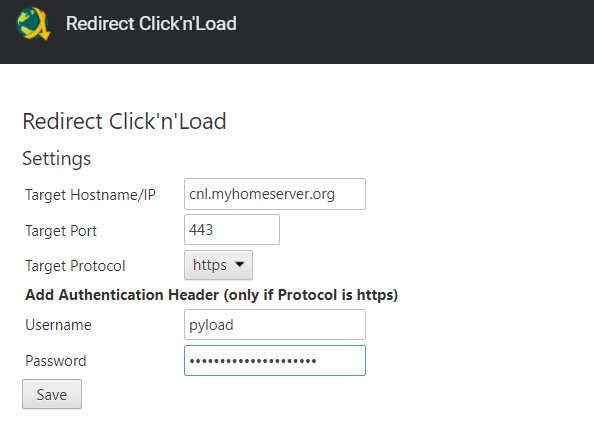

## Usage

Open Options and enter hostname or IP of the machine running pyload



## Non-https pitfalls

If you use a local IP Address as Target Host you have to allow "mixed-content".

```
chrome://settings/content/siteDetails?site=https%3A%2F%2Ffilecrypt.co
```


Visit some page which uses Click n Load


Wait until page gets green


## Changelog

* 2021-11-28
  * added support for https and basic authentication, due to stronger CORS policy enforcement. https://wicg.github.io/cors-rfc1918

<br>

* 2021-11-08
  * don't return redirectUrl if not matched. fixes [#5](https://github.com/werty1st/Redirect-Click-n-Load/issues/5)

<br>

* 2021-05-10
  * added option to redirect the port number
  * remove request listener on pause to leave the request untouched

<br>

* 2020-05-10
  * removed donation button
  * removed unused permissions
  * removed unused code


## Troubleshooting

* check if plugin is enabled (not paused)
* check if target is running and accessible
* check options if target hostname is still set


Video https://www.youtube.com/watch?v=BLyknZbai5g&feature=youtu.be
